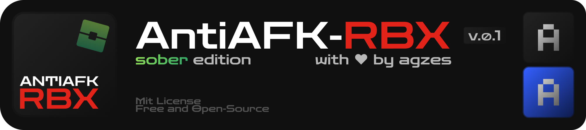

<p align="center">
  <a href="https://github.com/Agzes/AntiAFK-RBX"></a>
  
  <a href="#installation"></a>
</p>



<p align="center" width="100%">
  <a href="https://github.com/Agzes/AntiAFK-RBX-Sober/issues/new?template=feature_request.md"></a>
  <a href="https://boosty.to/agzes/donate"></a>
  <a href="https://github.com/Agzes/AntiAFK-RBX-Sober/issues/new?template=bug_report.md"></a>
</p>

---

Anti-AFK application specifically designed for **Sober** (Roblox on Linux). Currently focused on **Hyprland** environment (using "Swapper" mode).

## 🚀 Key Features

- **Swapper Mode**: Smart window management in Hyprland. The program switches focus, performs an action, and returns the cursor to its original position.
- **AFK Actions**: Jump (Space), Walk (W/S), or Camera Zoom (I/O).
- **Auto-Start/Stop**: Automatically enables when Sober is detected and disables once the game is closed.
- **User-Safe**: Pauses actions if user activity (mouse movement or key presses) is detected.
- **FPS Capper**: Limits CPU resource consumption of background game processes via `systemd CPUQuota`. [BETA]
- **Auto Reconnect**: Automatically clicks the "Reconnect" button on disconnect (uses `grim` for pixel analysis). [BETA]
- **Stealth Mode**: Ability to run the game in "hidden" mode (Special Workspace in Hyprland) during action execution.
- **System Tray**: Convenient control and status indication via the tray (powered by `ksni`).

## 📦 Installation & Setup

<a id="installation"></a>

### 1. Download

AppImage:
Download the latest version from the [Releases](https://github.com/Agzes/AntiAFK-RBX-Sober/releases) page.


### 2. uinput Permissions
The program requires write access to `/dev/uinput` to simulate input. The application includes a **"FIX"** button in the Compatibility section that sets this up automatically (requires sudo password).

But you can unlock it manually using (resets after reboot):
```bash
sudo chmod 666 /dev/uinput
```
Or create a udev rule (recommended, will be applied after reboot):
```bash
echo 'KERNEL=="uinput", MODE="0666"' | sudo tee /etc/udev/rules.d/99-uinput-antiafk.rules
sudo udevadm control --reload-rules && sudo udevadm trigger
```

### 3. Register Application (Desktop & Autostart)
*don't need if you install via AUR*

To add the application to your system menu, run the binary with the `--install` flag:
```bash
./AntiAFK-RBX-Sober --install
```
This will automatically:
- Create a `.desktop` entry in `~/.local/share/applications/`.
- Install the application icon to `~/.local/share/icons/`.

### 4. Dependencies
The `grim` utility is required for the "Auto Reconnect" feature to function.

## 🛠 Build

To build the project, you will need **Rust** (it is recommended to install via [rustup](https://rustup.rs/)).

### Install System Dependencies

> [!WARNING]
> AntiAFK-RBX-Sober support only Hyprland at this time. Support for other environments (GNOME, KDE, X11) is currently in development.

#### **Arch Linux / Manjaro / EndeavourOS / CachyOS**
```bash
sudo pacman -S --needed base-devel gtk4 grim pkg-config
```

#### **Fedora / Nobara**
```bash
sudo dnf install gtk4-devel grim gcc pkg-config
```

#### **Ubuntu / Debian / Linux Mint / Pop!_OS**
```bash
sudo apt install build-essential libgtk-4-dev grim pkg-config
```

### Compilation Process

1. Clone the repository:
```bash
git clone https://github.com/Agzes/AntiAFK-RBX-Sober.git
cd AntiAFK-RBX-Sober
```

2. Build the release version:
```bash
cargo build --release
```

The compiled binary will be located at `target/release/AntiAFK-RBX-Sober`.

## ⚠️ Important Note
Currently, the **Swapper** mode (main functionality) only supports **Hyprland**. Support for other environments (GNOME, KDE, X11) is currently in development.

---

<kbd>With</kbd> <kbd>❤️</kbd> <kbd>by</kbd> <kbd>Agzes</kbd><br>
<kbd>pls ⭐ project!</kbd>
